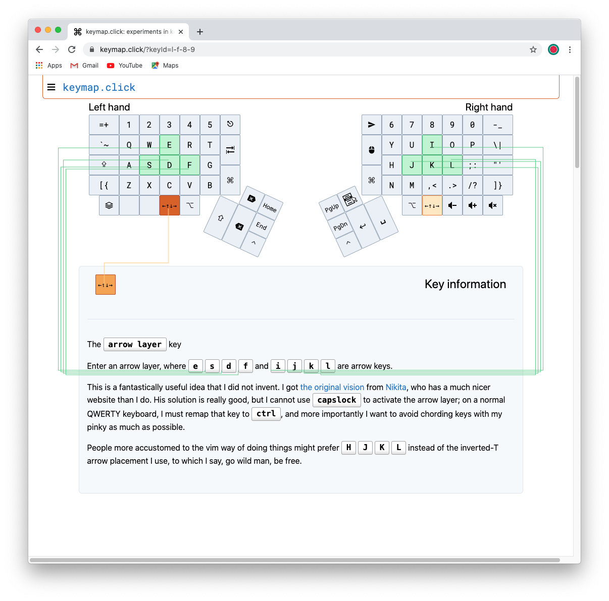
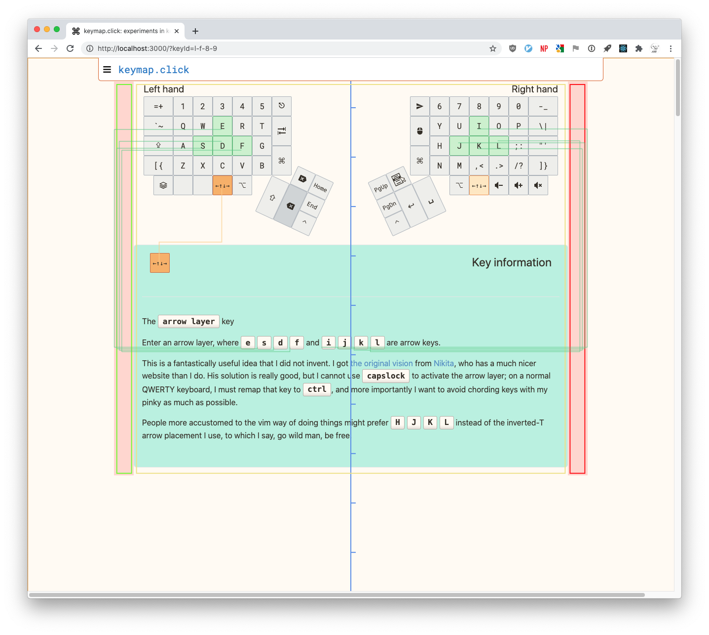
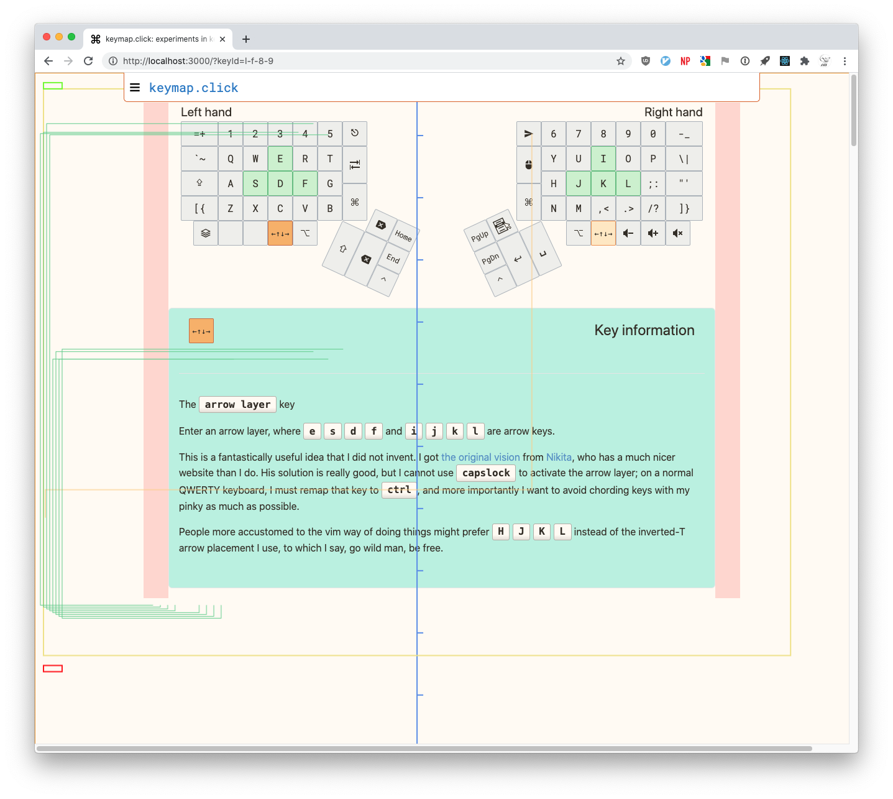

# Bad first render in production

(Hopefully?) the last bug to squash before I can release 1.0.

Only visible in production/release mode, not in dev mode.

```
# You'll never see it here:
npx next dev

# To see it do this:
npx next build
npx next start
```

Force-reloading (shift-cmd-r) and initial loads trigger this bug.
Reloading the page (cmd-r without shift) or clicking on a key from a loaded page does not exhibit the bug.

When the bug is triggered, all the diagram lines are drawn totally wrong. They should be connecting key references in the panel below with physical keys on the keyboard -- the green/orange lines should connect to green/orange keys respectively.

Here's what it looks like:


## Work log

- Hypothesis: something to do with static site generation?
- The bug behavior with visual debugging enabled screenshot seems to indicate that when the components are measured, they are not in their final position.
- Maybe CSS isn't getting applied when they get measured? Maybe something React specific is happening?
- I'm concerned that something I'm doing to measure the DOM isn't going right. That's happening in `useDocumentDimensions.js`.
- Can I test whether my render is statically generated at build time vs done client-side at page load time?
- I know the size of the canvas itself is ok, because I have `debug-trans-bg-orange` on it, and the whole screen does go orange.

## Triggering the bug

Go to <https://keymap.click/?keyId=l-f-8-9>.

You might have to force-refresh (shift-cmd-r or shift-f5) a few times, but usually for me the bug triggers on the first time without any force-refresh required.

### Visual debugging

I've added a "visual debugging" mode to my app so I can see what's going on. In that mode, I add background colors to specific divs, and I also draw lines on the canvas around certain measured elements. This lets me compare the layout of various elements to where my diagram code thinks they are when it starts drawing.

You can enable debugging with `/controls`, e.g. <https://keymap.click/controls>. Enable it in the "Debug level" dropdown and go back to the main page and click around - you should see a lot more info being drawn onto the screen.

## Screenshots

Here's what it looks like.

### Intended behavior normally

Here's what my app looks like when everything is working properly. Note the green lines connecting the keys in the text below to the corresponding keys on the board map above.



### Intended behavior with visual debugging enabled

Here's that correct view again, this time with visual debugging enabled. The light green and orange lines are all drawn as they were with visual debugging turned off, but there's a bunch more stuff drawn onto the screen too.

Note that the keyboard/panel is centered, with two reddish divs on either side -- the reddish color is a CSS `background-color` on that div. Note also the left rectangle has an inset limegreen box drawn over it, the right rectangle has an inset red box drawn over it, and the keyboard/info center section has a khaki box drawn over it -- these boxes are drawn on the canvas.



### Bug behavior with visual debugging enabled

This is what it looks like when I trigger the bug with visual debugging enabled. Note the divs are in the same place as in the correct view, but the drawn limegreen/red/khaki boxes are in very wrong places. The limegreen box is a tiny rectangle in the upper left, the khaki box is not confined to the center but goes almost from the left side of the window to the right, and the red box is another tiny rectangle in the lower left. Why is this? Does this reflect the locations of these divs before they were laid out by CSS?

Of course, the green and orange lines which should connect references in the panel below to locations in the board above are wildly off as well.


